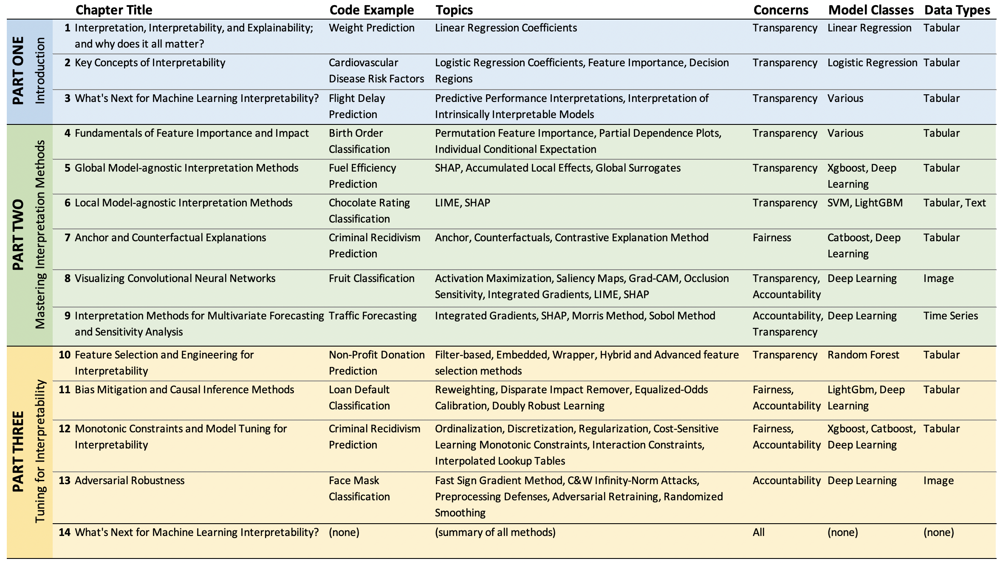

# Interpretable Machine Learning with Python

<a href="https://www.packtpub.com/product/interpretable-machine-learning-with-python/9781800203907"></a>

This is the code repository for [Interpretable Machine Learning with Python](https://www.packtpub.com/product/interpretable-machine-learning-with-python/9781800203907), published by Packt.

**Learn to build interpretable high-performance models with hands-on real-world examples**

## What is this book about?
Do you want to understand your models and mitigate the risks associated with poor predictions using practical machine learning (ML) interpretation? Interpretable Machine Learning with Python can help you overcome these challenges, using interpretation methods to build fairer and safer ML models.

This book covers the following exciting features: 
* Recognize the importance of interpretability in business
* Study models that are intrinsically interpretable such as linear models, decision trees, and Naïve Bayes
* Become well-versed in interpreting models with model-agnostic methods
* Visualize how an image classifier works and what it learns
* Understand how to mitigate the influence of bias in datasets

If you feel this book is for you, get your [copy](https://www.amazon.com/dp/180020390X) today!

<a href="https://www.packtpub.com/?utm_source=github&utm_medium=banner&utm_campaign=GitHubBanner"></a>


## Instructions and Navigations
All of the code is organized into folders. For example, Chapter02.

The code will look like the following:
```
base_classifier = KerasClassifier(model=base_model,\
                                  clip_values=(min_, max_))
y_test_mdsample_prob = np.max(y_test_prob[sampl_md_idxs],\
                                                       axis=1)
y_test_smsample_prob = np.max(y_test_prob[sampl_sm_idxs],\
                                                       axis=1)
```

**Following is what you need for this book:**
This book is for data scientists, machine learning developers, and data stewards who have an increasingly critical responsibility to explain how the AI systems they develop work, their impact on decision making, and how they identify and manage bias. Working knowledge of machine learning and the Python programming language is expected.

With the following software and hardware list you can run all code files present in the book (Chapter 1-14).

### Software and Hardware List

You can install the software required in any operating system by first installing [Jupyter Notebook or Jupyter Lab](https://jupyter.readthedocs.io/en/latest/install.html) with the most recent version of Python, or install [Anaconda](https://docs.anaconda.com/anaconda/) which can install everything at once. While hardware requirements for Jupyter are relatively modest, we recommend a machine with at least 4 cores of 2Ghz and 8Gb of RAM.

Alternatively, to installing the software locally, you can run the code in the cloud using Google Colab or another cloud notebook service.  

Either way, the following packages are required to run the code in all the chapters (Google Colab has all the packages denoted with a ^):

| Chapter      | Software required                     | OS required                        |
| ------------ | --------------------------------------| -----------------------------------|
| 1 - 13       | ^ Python 3.6+                         | Windows, Mac OS X, and Linux (Any) |
| 1 - 13       | ^ matplotlib 3.2.2+                   | Windows, Mac OS X, and Linux (Any) |
| 1 - 13       | ^ scikit-learn 0.22.2+                | Windows, Mac OS X, and Linux (Any) |
| 1 - 12       | ^ pandas 1.1.5+                       | Windows, Mac OS X, and Linux (Any) |
| 2 - 13       | machine-learning-datasets 0.01.16+    | Windows, Mac OS X, and Linux (Any) |
| 2 - 13       | ^ numpy 1.19.5+                       | Windows, Mac OS X, and Linux (Any) |
| 3 - 13       | ^ seaborn 0.11.1+                     | Windows, Mac OS X, and Linux (Any) |
| 3 - 13       | ^ tensorflow 2.4.1+                   | Windows, Mac OS X, and Linux (Any) |
| 5 - 12       | shap 0.38.1+                          | Windows, Mac OS X, and Linux (Any) |
| 1, 5, 10, 12 | ^ scipy 1.4.1+                        | Windows, Mac OS X, and Linux (Any) |
| 5, 10-12     | ^ xgboost 0.90+                       | Windows, Mac OS X, and Linux (Any) |
| 6, 11, 12    | ^ lightgbm 2.2.3+                     | Windows, Mac OS X, and Linux (Any) |
| 7 - 9        | alibi 0.5.5+                          | Windows, Mac OS X, and Linux (Any) |
| 10 - 13      | ^ tqdm 4.41.1+                        | Windows, Mac OS X, and Linux (Any) |
| 2, 9         | ^ statsmodels 0.10.2+                 | Windows, Mac OS X, and Linux (Any) |
| 3, 5         | rulefit 0.3.1+                        | Windows, Mac OS X, and Linux (Any) |
| 6, 8         | lime 0.2.0.1+                         | Windows, Mac OS X, and Linux (Any) |
| 7, 12        | catboost 0.24.4+                      | Windows, Mac OS X, and Linux (Any) |
| 8, 9         | ^ Keras 2.4.3+                        | Windows, Mac OS X, and Linux (Any) |
| 11, 12       | ^ pydot 1.3.0+                        | Windows, Mac OS X, and Linux (Any) |
| 11, 12       | xai 0.0.4+                            | Windows, Mac OS X, and Linux (Any) |
| 1            | ^ beautifulsoup4 4.6.3+               | Windows, Mac OS X, and Linux (Any) |
| 1            | ^ requests 2.23.0+                    | Windows, Mac OS X, and Linux (Any) |
| 3            | cvae 0.0.3+                           | Windows, Mac OS X, and Linux (Any) |
| 3            | interpret 0.2.2+                      | Windows, Mac OS X, and Linux (Any) |
| 3            | ^ six 1.15.0+                         | Windows, Mac OS X, and Linux (Any) |
| 3            | skope-rules 1.0.1+                    | Windows, Mac OS X, and Linux (Any) |
| 4            | PDPbox 0.2.0+                         | Windows, Mac OS X, and Linux (Any) |
| 4            | pycebox 0.0.1+                        | Windows, Mac OS X, and Linux (Any) |
| 5            | alepython 0.1+                        | Windows, Mac OS X, and Linux (Any) |
| 5            | tensorflow-docs 0.0.02+               | Windows, Mac OS X, and Linux (Any) |
| 6            | ^ nltk 3.2.5+                         | Windows, Mac OS X, and Linux (Any) |
| 7            | witwidget 1.7.0+                      | Windows, Mac OS X, and Linux (Any) |
| 8            | ^ opencv-python 4.1.2.30+             | Windows, Mac OS X, and Linux (Any) |
| 8            | ^ scikit-image 0.16.2+                | Windows, Mac OS X, and Linux (Any) |
| 8            | tf-explain 0.2.1+                     | Windows, Mac OS X, and Linux (Any) |
| 8            | tf-keras-vis 0.5.5+                   | Windows, Mac OS X, and Linux (Any) |
| 9            | SALib 1.3.12+                         | Windows, Mac OS X, and Linux (Any) |
| 9            | distython 0.0.3+                      | Windows, Mac OS X, and Linux (Any) |
| 10           | ^ mlxtend 0.14.0+                     | Windows, Mac OS X, and Linux (Any) |
| 10           | sklearn-genetic 0.3.0+                | Windows, Mac OS X, and Linux (Any) |
| 11           | aif360==0.3.0                         | Windows, Mac OS X, and Linux (Any) |
| 11           | BlackBoxAuditing==0.1.54              | Windows, Mac OS X, and Linux (Any) |
| 11           | dowhy 0.5.1+                          | Windows, Mac OS X, and Linux (Any) |
| 11           | econml 0.9.0+                         | Windows, Mac OS X, and Linux (Any) |
| 11           | ^ networkx 2.5+                       | Windows, Mac OS X, and Linux (Any) |
| 12           | bayesian-optimization 1.2.0+          | Windows, Mac OS X, and Linux (Any) |
| 12           | ^ graphviz 0.10.1+                    | Windows, Mac OS X, and Linux (Any) |
| 12           | tensorflow-lattice 2.0.7+             | Windows, Mac OS X, and Linux (Any) |
| 13           | adversarial-robustness-toolbox 1.5.0+ | Windows, Mac OS X, and Linux (Any) |

**NOTE**: the library _machine-learning-datasets_ is the official name of what in the book is referred to as _mldatasets_. Due to naming conflicts, it had to be changed. 

The exact versions of each library, as tested, can be found in the [requirements.txt](https://github.com/PacktPublishing/Interpretable-Machine-Learning-with-Python/blob/master/requirements.txt) file and installed like this should you have a dedicated environment for them:

`> pip install -r requirements.txt`

You might get some conflicts specifically with libraries `cvae`, `alepython`, `pdpbox` and `xai`. If this is the case, try:

`> pip install --no-deps -r requirements.txt`

Alternatively, you can install libraries one chapter at a time inside of a local Jupyter environment using cells with `!pip install` or run all the code in Google Colab with the following links: 

- [Chapter 01 - WeightPrediction.ipynb](https://colab.research.google.com/drive/1rO79oCPGSz-XQaE1Ikcotdn32Xkb5N7S?usp=sharing)
- [Chapter 02 - CVD.ipynb](https://colab.research.google.com/drive/1CiUPbK_xgXFq6735O320a_3GUiuY4XGZ?usp=sharing)
- [Chapter 03 - FlightDelays.ipynb](https://colab.research.google.com/drive/15z8dLNCzVbY7Y3Uq0GAAnSJ4nJgNmlPU?usp=sharing)
- [Chapter 04 - BirthOrder.ipynb](https://colab.research.google.com/drive/1HZQ4nz_TrIj31-9oMgAhVVfoZKsHPs8S?usp=sharing)
- [Chapter 05 -  FuelEfficiency.ipynb](https://colab.research.google.com/drive/1t3jdsCzSwZcaxekjOofXoBQeqkpCsbCj?usp=sharing)
- [Chapter 06 - ChocoRatings.ipynb](https://colab.research.google.com/drive/1_BtKFK-HxJ6GZfVJ4wbDwLM3Bvc6ZXS2?usp=sharing)
- [Chapter 07 - Recidivism_part1.ipynb](https://colab.research.google.com/drive/1xG0FexLMPKkgHKPWYst-wY7WRPpqdOfm?usp=sharing)
- [Chapter 08 - FruitClassifier_part1.ipynb](https://colab.research.google.com/drive/1oGko32CqTQYCQo3OH_CEBEipF9svg7Gx?usp=sharing)
- [Chapter 08 - FruitClassifier_part2.ipynb](https://colab.research.google.com/drive/1g1ZXls0KbCQol16utbSRcPgfl0fM9s-U?usp=sharing)
- [Chapter 09 - Traffic.ipynb](https://colab.research.google.com/drive/1OZeg43hVqu1k_hjXFy5mnoBtUWnyVKFC?usp=sharing)
- [Chapter 10 - Mailer.ipynb +](https://colab.research.google.com/drive/125Ehcke4VTrJp-qECVbvYn_0GNJsgVex?usp=sharing)
- [Chapter 11 - CreditCardDefaults.ipynb](https://colab.research.google.com/drive/13_8zsZMcgqU7V1VrpeMrqKwQgr623z6V?usp=sharing)
- [Chapter 12 - Recidivism_part2.ipynb +](https://colab.research.google.com/drive/14c95pjFgth5FLSAlzvSDnhRh9W9iDYdJ?usp=sharing)
- [Chapter 13 - Masks_part1.ipynb](https://colab.research.google.com/drive/1qyOpum5OIY9jQJXaxkx6A6qedwb4mEzJ?usp=sharing)
- [Chapter 13 - Masks_part2.ipynb +](https://colab.research.google.com/drive/1jK9YsSgVfiD4YXYDyoQ27uLT06f-SPYZ?usp=sharing)

Remember to make sure you click on the menu item __"File > Save a copy in Drive"__ as soon you open each link to ensure that your notebook is saved as you run it. Also, notebooks denoted with plus sign (+) are relatively compute-intensive, and will take  an extremely long time to run on Google Colab but if you must go to __"Runtime > Change runtime type"__ and select __"High-RAM"__ for runtime shape. Otherwise, a better cloud enviornment or local environment is preferable.  

We also provide a PDF file that has color images of the screenshots/diagrams used in this book. [Click here to download it](https://static.packt-cdn.com/downloads/9781800203907_ColorImages.pdf).

### Summary

The book does much more than explain technical topics, but here's a summary of the chapters:



### Related products <Other books you may enjoy>
* Automated Machine Learning [[Packt]](https://www.packtpub.com/product/automated-machine-learning/9781800567689) [[Amazon]](https://www.amazon.com/dp/1800567685)

* Hands-On Machine Learning with scikit-learn and Scientific Python Toolkits [[Packt]](https://www.packtpub.com/product/hands-on-machine-learning-with-scikit-learn-and-scientific-python-toolkits/9781838826048) [[Amazon]](https://www.amazon.com/dp/1838826041)

## Get to Know the Authors
**Serg Masís**
has been at the confluence of the internet, application development, and analytics for the last two decades. Currently, he's a Climate and Agronomic Data Scientist at Syngenta, a leading agribusiness company with a mission to improve global food security. Before that role, he co-founded a startup, incubated by Harvard Innovation Labs, that combined the power of cloud computing and machine learning with principles in decision-making science to expose users to new places and events. Whether it pertains to leisure activities, plant diseases, or customer lifetime value, Serg is passionate about providing the often-missing link between data and decision-making — and machine learning interpretation helps bridge this gap more robustly.
### Download a free PDF

 <i>If you have already purchased a print or Kindle version of this book, you can get a DRM-free PDF version at no cost.<br>Simply click on the link to claim your free PDF.</i>
<p align="center"> <a href="https://packt.link/free-ebook/9781800203907">https://packt.link/free-ebook/9781800203907 </a> </p>